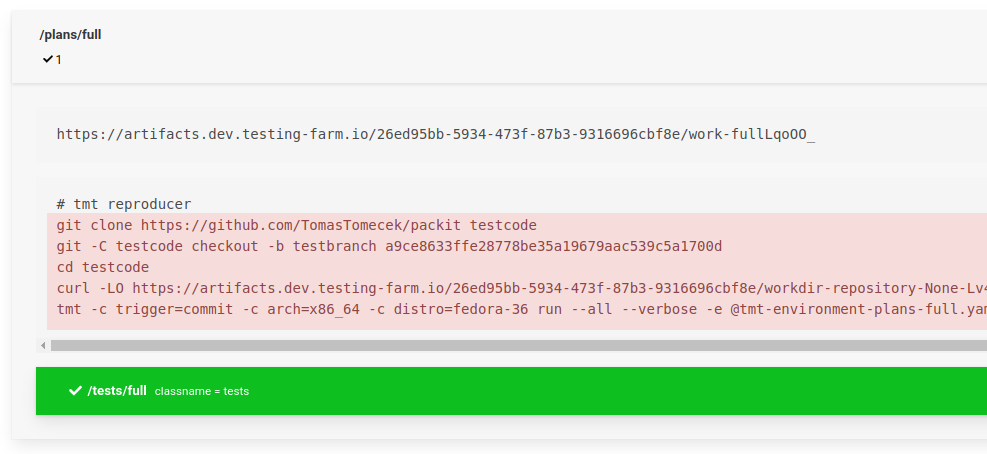

# Reproduce CI environment locally

This used to be a question [in our FAQ](faq#a-command-failed-in-packit-service-how-do-i-reproduce-it-locally) and
now we have a dedicated document to cover this.

## SRPM builds in Copr
For Copr builds, the corresponding SRPM builds are being built in directly in Copr. This
section describes how you can reproduce the build procedure locally.

We invoke our CLI command `packit prepare-sources` in the Copr environment,
the command may look like this for a job triggered by a pull request change:
```
$ packit prepare-sources --result-dir directory-to-place-sources --pr-id 150 
--merge-pr --target-branch main --job-config-index 2 https://github.com/packit/packit
```
As a first step, you can run this command 
locally on your computer (if you have installed the needed dependencies for your actions) 
and see whether the sources are correctly prepared.

Thankfully, Copr is very transparent how it performs builds. When you open a
build log (e.g. `builder-live.log.gz`), you'll see a command at the top which
Copr invokes to perform a build. Let's do that in a container.

```
$ podman run --privileged -ti fedora:36 bash
```

(the reason for running root privileged container is that
[mock](https://github.com/rpm-software-management/mock) will be used inside and
needs capabilities to perform
[unshare](https://man7.org/linux/man-pages/man1/unshare.1.html))

But first we need to install the package which contains the `copr-rpmbuild` command:
```
[root@f26be2947a15 /]# dnf install -y copr-rpmbuild
```

Now let's rerun locally a build for build-id 3580313:
```
[root@f26be2947a15 /]# /usr/bin/copr-rpmbuild --verbose --drop-resultdir --srpm --build-id 3580313
```

Your changes need to be pushed and a PR needs to be created for this to work.
You are welcome to experiment with `copr-rpmbuild` to get a more efficient
workflow (hint `--task-file`).

<!--
I am deliberately making this a HTML comment. One can actually feed this json into copr-rpmbuild and not have a build-id.
{"appstream": true,
 "background": false,
 "build_id": 3580370,
 "chroot": "fedora-36-x86_64",
 "project_dirname": "TomasTomecek-cockpit-2-stg",
 "project_name": "TomasTomecek-cockpit-2-stg",
 "project_owner": "packit",
 "sandbox": "packit/TomasTomecek-cockpit-2-stg--packit",
 "source_json": "{\"builddeps\": \"https://download.copr.fedorainfracloud.org/results/packit/packit-dev/fedora-35-x86_64/03543667-packit/packit-0.46.1.dev21+gb9fc3f9-1.20220224155042545406.main.21.gb9fc3f9.fc35.noarch.rpm https://download.copr.fedorainfracloud.org/results/packit/packit-dev/fedora-35-x86_64/03543667-packit/python3-packit-0.46.1.dev21+gb9fc3f9-1.20220224155042545406.main.21.gb9fc3f9.fc35.noarch.rpm npm selinux-policy autogen autoconf automake\", \"chroot\": \"fedora-36-x86_64\", \"resultdir\": \"\", \"script\": \"#!/bin/sh\\ngit config --global user.email 'hello@packit.dev'\\ngit config --global user.name 'Packit'\\nresultdir=$PWD\\npackit -d prepare-sources --result-dir $resultdir --pr-id 2 --merge-pr --target-branch main --job-config-index 1 https://github.com/TomasTomecek/cockpit\\n\"}",
 "source_type": 9,
 "submitter": "packit",
 "task_id": "3580370"}
-->

## `actions` commands run in our sandbox

Packit by default runs all commands from `actions` (e.g. during syncing the release or building SRPMs for Koji builds)
you defined in a [sandbox](https://github.com/packit/sandcastle) which is a Kubernetes pod in a
new project (the only exception are the commands run during SRPM build for Copr builds described above; they are run in the Copr).

You can reproduce our sandbox environment: Firstly, you should pull our
production sandbox image and run commands of your choice inside the container.
As an example, this is how we were debugging build problems with anaconda:

1. Clone your upstream git repo.

2. Launch the container and bind-mount the upstream project inside:
```
$ podman run -ti --rm --memory 768MB -v $PWD:/src -w /src quay.io/packit/sandcastle:prod bash
```

3. Run commands of your choice:
```
[root@4af5dbd9c828 src]# ./configure
checking for a BSD-compatible install... /usr/bin/install -c
checking whether build environment is sane... yes
checking for a thread-safe mkdir -p... /usr/bin/mkdir -p
checking for gawk... gawk
checking whether make sets $(MAKE)... yes
checking whether make supports nested variables... yes
checking whether UID '0' is supported by ustar format... yes
checking whether GID '0' is supported by ustar format... yes
checking how to create a ustar tar archive... gnutar
checking whether make supports nested variables... (cached) yes
checking whether make supports the include directive... yes (GNU style)
checking for gcc... gcc
checking whether the C compiler works... yes
...
```

Our deployment is running in [OpenShift
ROSA](https://docs.openshift.com/rosa/welcome/index.html).

Since OpenShift [invokes pods using arbitrary
UIDs](https://www.openshift.com/blog/a-guide-to-openshift-and-uids) and as you
can see, the command above is invoked as root, it does not match production
packit-service. So, if running a local container didn't help you with
reproducing the issue, you can try running it in openshift.

Here is a simple python code how packit-service does it:
```python
from sandcastle import Sandcastle

# this should be the path to your local clone of the upstream project
git_repo_path: str = "fill-me"
# kubernetes namespace to use
k8s_namespace: str = "myproject"
command = ["your", "command", "of", "choice"]

# This is how your code gets copied (via rsync) into the openshift pod
m_dir = MappedDir(git_repo_path, "/sandcastle", with_interim_pvc=True)

o = Sandcastle(
    image_reference="docker.io/usercont/sandcastle:prod",
    k8s_namespace_name=k8s_namespace,
    mapped_dir=m_dir
)
o.run()
try:
    output = o.exec(command=command)
    print(output)
finally:
    o.delete_pod()
```

This script requires:
 * [sandcastle](https://github.com/packit/sandcastle) installed
 * being logged in an openshift cluster (`oc whoami` to confirm)
 * rsync binary available

If none of these helped you, please [reach out](/#contact) to us and we'll try to help you.


## Testing Farm

When you open test results, you can see commands which Testing Farm performed
to run your test. You can run those locally.



The team is also planning to have a solution to fully reproduce the CI testing
process locally:
[teemtee/tmt#1075](https://github.com/teemtee/tmt/issues/1075).
