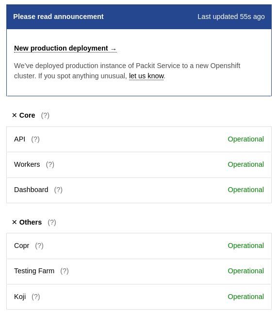
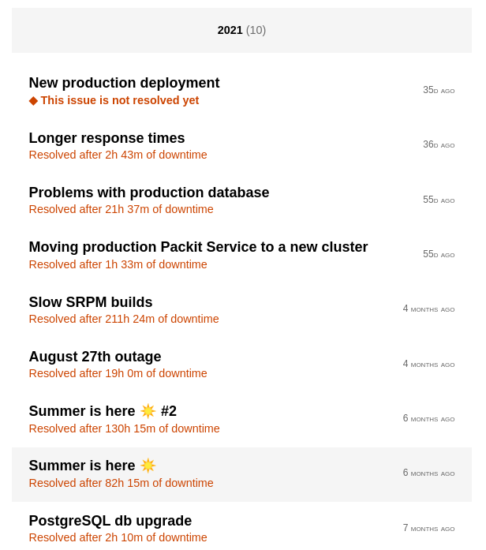

# Packit project in 2021

The previous year 2021 wasn't interesting only because of the increased usage of Packit
(you can see more in [the previous post](../2021-in-numbers)).
The whole Packit team made a lot of improvements during the year.
Some small, some really big. So, let's take a look at the most important ones:

## Dashboard

The idea of having a dashboard for Packit service started as a
[Google Summer of Code 2020 project](https://communityblog.fedoraproject.org/gsoc-progress-report-dashboard-for-packit-july-1-aug-16-2020/)
to provide a basic view of our service.
Thanks [Anchit](https://github.com/IceWreck) for starting this!
Nowadays, it's a core part of the project and it has replaced the result pages in plain HTML. Do you remember them?

The dashboard can be found at [dashboard.packit.dev](https://dashboard.packit.dev).

Following picture shows a more convenient and visually-appealing view of builds and test runs.
For better context, the relevant pages are a connected to each other.

If you want to see the overall picture, use our [pipelines view](https://dashboard.packit.dev/pipelines) that was created exactly for that:

### Future of the dashboard

We consider our dashboard an important part of our service and are working on or planning more improvements:

- We are working on personalised pages for a user or git-forge namespace.
- We are planning to show info about other job types we support by the service as well;
  especially the `propose-downstream` one.
- We are doing some database schema updates to be able to better interconnect various pages.
- Do you have an idea for an improvement?
  Let us know by creating an issue [here](https://github.com/packit/dashboard/issues/new).

## Development

From the very start, Packit is developed publicly in an open-source way.
We participate in various projects like Google Summer of Code, Red Hat Open Source Contest and Hacktoberfest.
But we are also very glad if anyone from our users contributes and fixes some pain point.
To help with that, we've renamed all our branches to `main` and rapidly enhanced our contribution guide(s).
We would like to encourage you not to be afraid of contributing to any of [our projects](https://github.com/packit/).
We are prepared to help you with that.

If you want to keep an eye on what we are currently working on, check our [_Packit upstream work_ board on GitHub](https://github.com/orgs/packit/projects/4).

## Testing Farm

The year 2021 was a tough one for our test workflow. For those who don't know, we use Testing Farm as our test runner.
At the beginning of the year, we switched to the new Testing Farm API version
(because the old one had died with the infrastructure it had been running on).
Unlike the old version, the new one fully supports `tmt` as a test definition.

During the year, a set of supported environments was enhanced by `centos-6`, `oraclelinux` and `aarch64`.
For Red Hat teams, we added support for using the internal instance of the Testing Farm.
Let us know if you are interested in this.
But no worries, you can use `centos-stream` and other publicly available environments.

Originally, the tests were run after the installation of the packages built using Copr from the source repository.
Newly, you can skip this step and run the tests without any build. This allows you to use Packit&TestingFarm
for repositories containing only test definitions (e.g. QE teams).

Lastly, we send some environment variables to the test environment and you can define your own if you want.

As we see, testing is a key feature for some teams and we still want to improve test use-cases
-- let us know if you are missing anything ([here](https://github.com/packit/packit-service/issues/new) or
[in the Testing Farm issue tracker](https://gitlab.com/groups/testing-farm/-/issues)).

## Service

To get users quickly know that we accepted the task and started working on it, we added two nice features
-- `:1` reaction for the comment that we are reacting on and `task accepted` commit status.

Speaking of statuses, we switched to a more feature-rich API called GitHub Check Runs.
It allows us to create a separate result page where we can show more information
-- e.g. more links when needed and more space for hints when there is a problem.
You can also find the run results on a separate `Checks` tab of the pull-requests page.
The check run page contains only the basic info and we don't want to replace a dashboard with this.
(Because of the consistency between git-forges and to be able to link the related dashboard pages.)
Another feature of check runs you might find useful is being able to re-run the failed test with just one click
(see the `Re-run` button in the following screenshot).

Inspired by other systems (like Zuul), for pull-requests we started using merge state
so you can be sure the state we use is the same as the one with the pull-request being merged.
We are working with the Testing Farm team to add the support there as well so the test definition is consistent with the build.
But no worries, you can disable this if you don't want this behaviour.

## Downstream

One of our current initiatives is to help maintainers in the downstream part of the workflow as well.
We had the first part of that for some time in a form of `propose-downstream` job (you can expect more enhancements on this front),
but we newly support triggering Koji builds for new commits in dist-git.

When there is a new dist-git commit that contains Packit config with the defined `koji_build` job,
Packit will trigger the Koji build for you.
It's fresh and basic so far so give us some time to announce this with more details.
The next step will be to create a Bodhi update when the build successfully finishes and that is
what is currently being worked on.

## Status Page

Yes, we have a status page where you can check if everything is ok with our service.
It can be found at [status.packit.dev](https://status.packit.dev/)
On the page, you can find a list of incidents we resolved or are trying to fix.
If you don't see any incident and still think the service isn't working as expected, please,
let us know (see [contacts](/#contact)).
Another useful source of information is the [pipelines view](https://dashboard.packit.dev/pipelines) on our dashboard.

## Future

As you see, we managed to accomplish a lot last year. And what you can expect this year?
[Let us know]() if you have some ideas and want to influence that!
